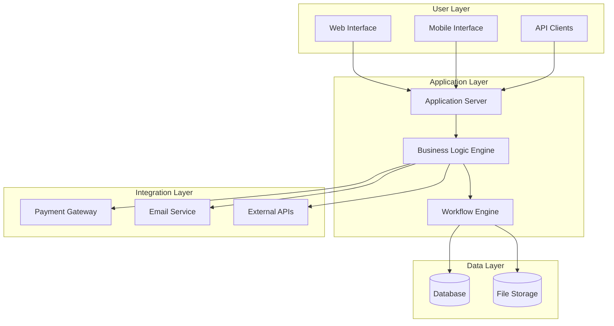
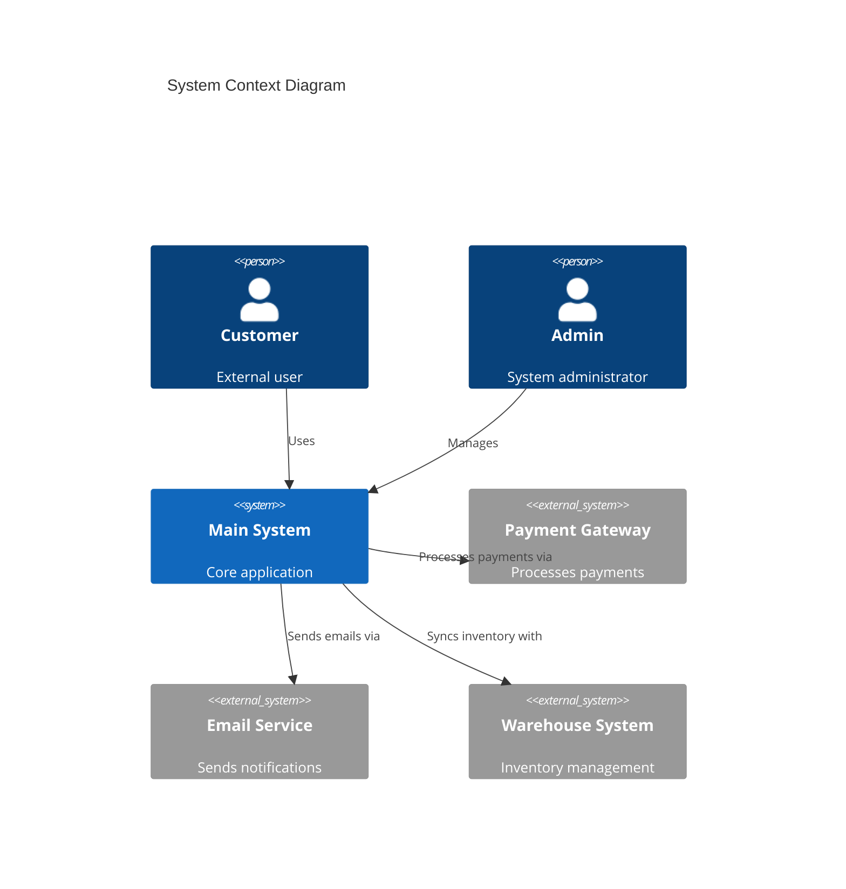
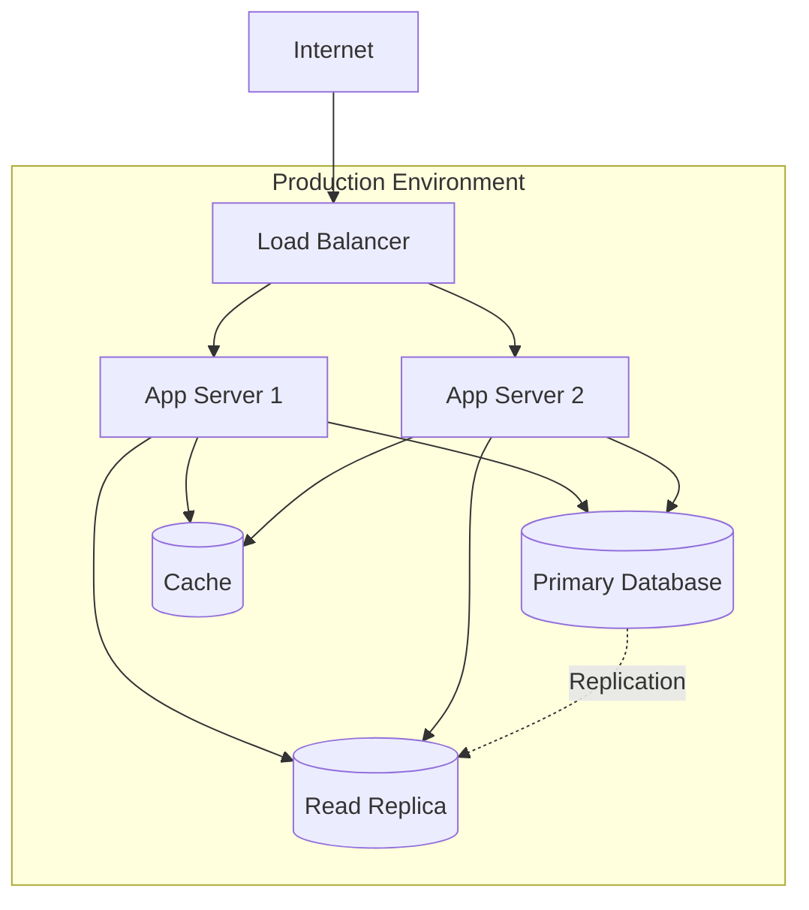
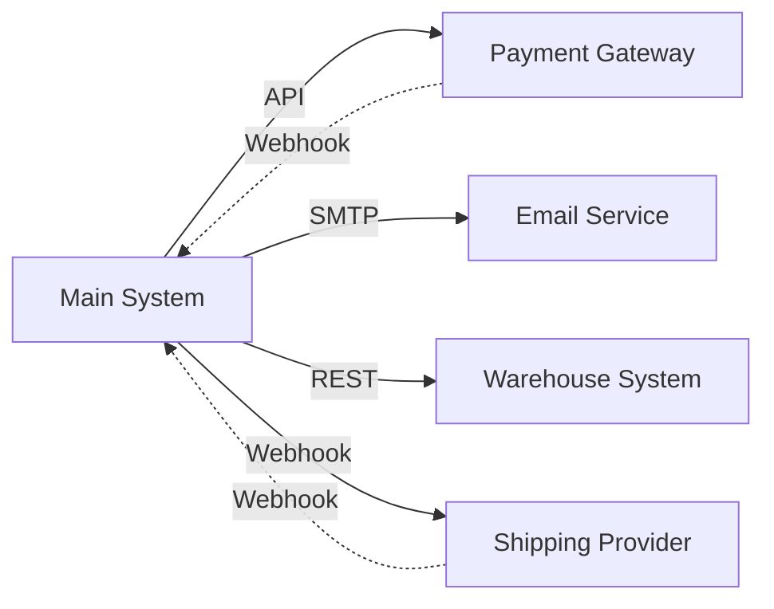
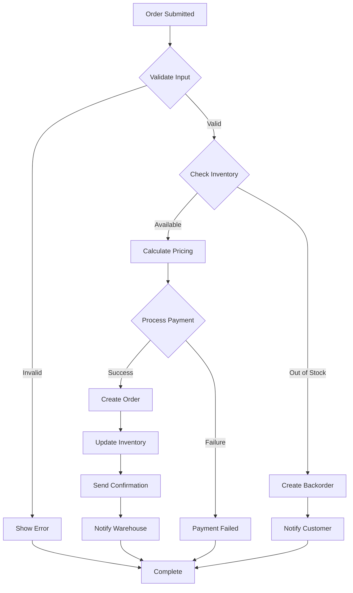
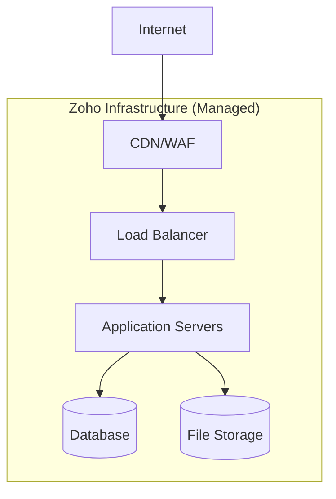

# System Mapper

Synthesizes discovered information (from API exploration, script analysis, etc.) into comprehensive system documentation including architecture diagrams, integration maps, and data flows.

## When to Use

Use this skill after:
- API/schema discovery is complete
- Scripts have been analyzed
- You have entity relationships mapped
- Integration points identified

## Prerequisites

Expected input files:
- Entity schemas (JSON or markdown)
- Script analysis results
- Relationship data
- Integration catalog

## Output Structure

Generate a comprehensive system documentation package:

```
docs/
├── 00-system-overview.md
├── 01-architecture-diagrams.md
├── 02-data-model.md
├── 03-integration-map.md
├── 04-workflows.md
├── 05-deployment-topology.md
└── 06-security-and-access.md
```

## Documentation Templates

### 00-system-overview.md

```markdown
# {System Name} - System Overview

## Purpose
[What the system does, why it exists]

## Key Capabilities
- Capability 1
- Capability 2
- Capability 3

## Users
- **User Type 1**: [Role and access level]
- **User Type 2**: [Role and access level]

## Technology Stack
- **Platform**: Zoho Creator / Custom / etc.
- **Database**: [Type and version]
- **Hosting**: Cloud / On-premise
- **Integrations**: [List major integrations]

## Critical Dependencies
1. Dependency 1 - [Purpose]
2. Dependency 2 - [Purpose]

## Metrics
- **Total Entities**: X
- **Total Scripts/Functions**: Y
- **External Integrations**: Z
- **Active Users**: ~N
```

### 01-architecture-diagrams.md

```markdown
# Architecture Diagrams

## High-Level System Architecture



## Component Architecture



## Deployment Topology


```

### 02-data-model.md

```markdown
# Data Model

## Entity-Relationship Diagram

[Include ER diagram from data-model-visualizer skill]

## Entities

### Entity 1: {Name}

**Purpose**: [What this entity represents]

**Key Fields**:
| Field | Type | Required | Description |
|-------|------|----------|-------------|
| id | ID | Yes | Primary key |
| name | Text | Yes | Display name |
| ... | ... | ... | ... |

**Relationships**:
- **Parent**: [Entity name] (one-to-many)
- **Children**: [Entity name] (one-to-many)
- **References**: [Entity name] (lookup)

**Business Rules**:
- Rule 1: [Description]
- Rule 2: [Description]

**Sample Record**:
```json
{
  "id": "12345",
  "name": "Sample Product",
  ...
}
```

[Repeat for each entity]

## Data Volume Estimates

| Entity | Estimated Records | Growth Rate |
|--------|------------------|-------------|
| Products | 10,000 | 100/month |
| Orders | 50,000 | 500/month |
| ... | ... | ... |
```

### 03-integration-map.md

```markdown
# Integration Map

## External Systems



## Integration Details

### Integration 1: Payment Gateway (Stripe)

- **Provider**: Stripe
- **Type**: RESTful API
- **Authentication**: API Key
- **Direction**: Bidirectional (API calls + webhooks)
- **Endpoints Used**:
  - `POST /v1/charges` - Create payment
  - `POST /v1/refunds` - Process refund
- **Webhooks Received**:
  - `charge.succeeded`
  - `charge.failed`
- **Data Exchanged**:
  - Outbound: Amount, customer details, payment method
  - Inbound: Transaction ID, status
- **Error Handling**: Retry 3 times with exponential backoff
- **SLA**: 99.9% uptime
- **Documentation**: https://stripe.com/docs/api

### Integration 2: Payment Gateway (PayPal)

- **Provider**: PayPal
- **Type**: RESTful API
- **Authentication**: OAuth 2.0 (Client ID/Secret)
- **Direction**: Bidirectional (API calls + webhooks)
- **Endpoints Used**:
  - `POST /v2/checkout/orders` - Create payment order
  - `POST /v2/payments/captures/{id}/refund` - Process refund
- **Webhooks Received**:
  - `PAYMENT.CAPTURE.COMPLETED`
  - `PAYMENT.CAPTURE.DENIED`
- **Data Exchanged**:
  - Outbound: Amount, customer details
  - Inbound: Order ID, capture ID, status
- **Error Handling**: Retry 3 times with exponential backoff
- **SLA**: 99.9% uptime
- **Documentation**: https://developer.paypal.com/docs/api/

[Repeat for each integration]

## API Endpoints Exposed

| Endpoint | Method | Purpose | Authentication | Rate Limit |
|----------|--------|---------|----------------|------------|
| /api/v1/products | GET | List products | OAuth 2.0 | 100/min |
| /api/v1/orders | POST | Create order | OAuth 2.0 | 50/min |
| ... | ... | ... | ... | ... |
```

### 04-workflows.md

```markdown
# Workflows

## Major Business Processes

### Workflow 1: Order Processing

**Trigger**: Customer submits order form

**Steps**:
1. Validate customer information
2. Check product availability
3. Calculate pricing (subtotal, tax, shipping, discounts)
4. Process payment
5. Create order record
6. Update inventory
7. Send confirmation email
8. Notify warehouse for fulfillment

**Flow Diagram**:



**Involved Components**:
- Forms: Order Form, Payment Form
- Scripts: `process_order.ds`, `calculate_pricing.ds`, `update_inventory.ds`
- Integrations: Stripe/PayPal (payment), SendGrid (email), Warehouse API

**Exception Handling**:
- Insufficient inventory → Create backorder, notify customer
- Payment failure → Log error, send admin alert, allow customer retry
- Integration timeout → Retry 3 times, then manual intervention

[Repeat for each major workflow]

## Scheduled Tasks

| Task | Schedule | Purpose | Script/Job |
|------|----------|---------|------------|
| Inventory Sync | Hourly | Sync with warehouse system | `sync_inventory.ds` |
| Daily Reports | Daily 6am | Generate sales reports | `generate_reports.ds` |
| Cleanup | Weekly | Archive old records | `archive_old_data.ds` |
```

### 05-deployment-topology.md

```markdown
# Deployment Topology

## Current State

**Hosting**: Zoho Creator SaaS

**Environment**: Production only (no separate dev/staging in traditional sense)

**Data Center**: [Region, if known]

**Scaling**: Automatic (managed by Zoho)

**Backup**: Managed by Zoho (frequency and retention TBD)

## Access Patterns

**User Access**:
- Web: `https://creatorapp.zoho.com/{account}/{app}`
- Mobile: Zoho Creator mobile app
- API: `https://creator.zoho.com/api/v2.1/...`

**Admin Access**:
- Creator Builder: Via Zoho account with developer role
- Database: Via Creator UI only (no direct SQL access)

## Network Topology



## Security Controls

- **Authentication**: Zoho accounts + optional SSO (SAML, OAuth)
- **Authorization**: Role-based access control (RBAC)
- **Encryption**: TLS in transit, at-rest encryption (managed by Zoho)
- **Network**: Firewall rules (managed by Zoho)
- **Audit Logging**: Available via Zoho Creator audit logs

## Disaster Recovery

- **Backup Frequency**: [TBD - confirm with Zoho]
- **Recovery Time Objective (RTO)**: [TBD]
- **Recovery Point Objective (RPO)**: [TBD]
- **DR Site**: [TBD - Zoho's DR setup]
```

### 06-security-and-access.md

```markdown
# Security and Access Control

## Authentication

**Primary Method**: Zoho Accounts

**Supported Protocols**:
- OAuth 2.0
- SAML 2.0 (for SSO)
- Two-Factor Authentication (2FA)

## Authorization Model

**Roles**:
| Role | Permissions | User Count |
|------|-------------|------------|
| Admin | Full access | 2 |
| Manager | Read/write, no delete | 5 |
| User | Read-only | 100+ |

**Permission Levels**:
- Form-level: Who can view/edit specific forms
- Report-level: Who can access which reports
- Record-level: Row-level security based on ownership

## Data Security

**Sensitive Data**:
- Customer PII (names, emails, addresses)
- Payment information (handled by Stripe, not stored)
- [Other sensitive data types]

**Data Handling**:
- PII: Stored in Zoho Creator database, encrypted at rest
- Payment: Tokenized via Stripe, tokens stored
- Audit logs: Retention period [TBD]

**Compliance Requirements**:
- GDPR: [Compliance status]
- PCI DSS: Not applicable (no card data stored)
- [Other relevant standards]

## API Security

**Authentication**: OAuth 2.0

**Rate Limiting**:
- Standard tier: 100 calls/minute
- Premium tier: [TBD]

**IP Whitelisting**: Supported for API access

## Security Findings

[Link to security findings from Deluge analysis or security audit]

## Recommended Improvements

1. **Implement SSO**: Reduce password-based authentication risk
2. **Enable 2FA**: For all admin and manager accounts
3. **API Key Rotation**: Establish 90-day rotation policy
4. **Audit Log Review**: Monthly review of access logs
```

## Synthesis Workflow

### Step 1: Gather Inputs

Collect all discovery artifacts:

```bash
# Find all discovery outputs
find . -name "*schema*.json" -o -name "*analysis*.md" -o -name "*inventory*.md"
```

Read:
- Entity schemas
- Script analysis results
- Integration catalog
- Sample data

### Step 2: Create Architecture Diagram

Synthesize a high-level architecture:

1. Identify layers (UI, application, data, integration)
2. Map components to layers
3. Show data flows
4. Highlight external dependencies

### Step 3: Document Data Model

Consolidate entity information:

1. List all entities
2. For each entity:
   - Fields and types
   - Relationships
   - Business rules
   - Sample records
3. Create ER diagram

### Step 4: Map Integrations

Document all external touchpoints:

1. Identify integration points from script analysis
2. For each integration:
   - Provider/system name
   - API type and authentication
   - Endpoints used
   - Data exchanged
   - Error handling
3. Create integration diagram

### Step 5: Document Workflows

Extract business processes:

1. Identify major user journeys
2. Map step-by-step flows
3. Create flowcharts
4. Note exception handling

### Step 6: Describe Deployment

Document current deployment:

1. Hosting (SaaS, cloud, on-prem)
2. Environment topology
3. Access patterns
4. Security controls

### Step 7: Compile Security Info

Aggregate security findings:

1. Authentication mechanisms
2. Authorization model
3. Data security measures
4. Identified risks
5. Recommendations

## Output Validation

Checklist before finalizing:

- [ ] All entities documented with schemas
- [ ] All integrations catalogued
- [ ] Major workflows visualized
- [ ] Architecture diagram complete and accurate
- [ ] Security controls documented
- [ ] Deployment topology clear
- [ ] All Mermaid diagrams render correctly
- [ ] Cross-references between docs working
- [ ] Consistent formatting and terminology

## Best Practices

1. **Use Consistent Terminology**: Match system's own naming
2. **Visual > Text**: Prefer diagrams for architecture and flows
3. **Link Artifacts**: Cross-reference between documents
4. **Version Documentation**: Include "as of" dates
5. **Highlight Gaps**: Note areas needing more investigation (TBD)
6. **Actionable Findings**: Security and improvement recommendations should be specific

## Example: Complete Documentation Package

After running this skill, you should have:

```
docs/storekeeper/
├── 00-system-overview.md (3-5 pages)
├── 01-architecture-diagrams.md (5-7 diagrams)
├── 02-data-model.md (15-30 pages, depending on entities)
├── 03-integration-map.md (5-10 pages)
├── 04-workflows.md (10-20 pages)
├── 05-deployment-topology.md (3-5 pages)
└── 06-security-and-access.md (5-8 pages)
```

This becomes the comprehensive system documentation for stakeholders, developers, and future migration efforts.
